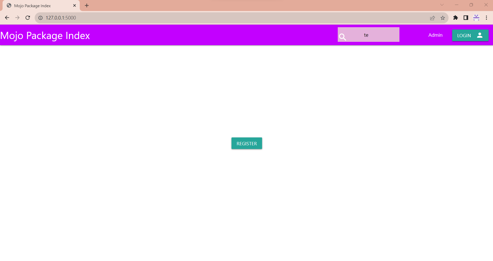
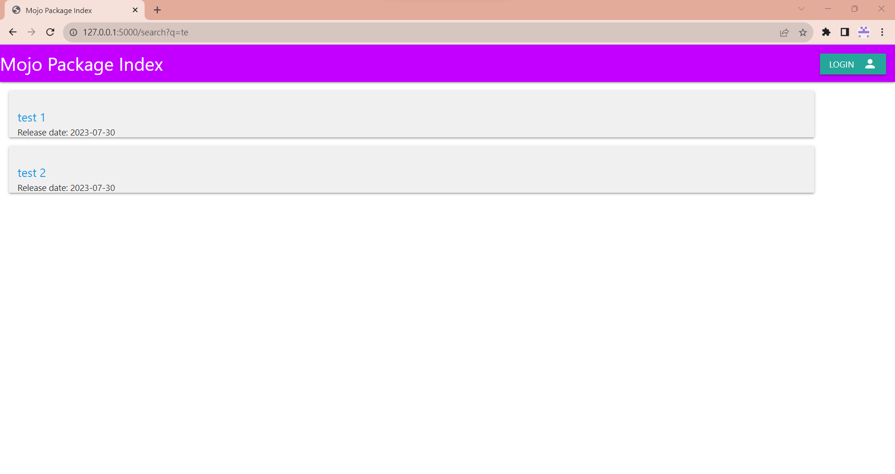
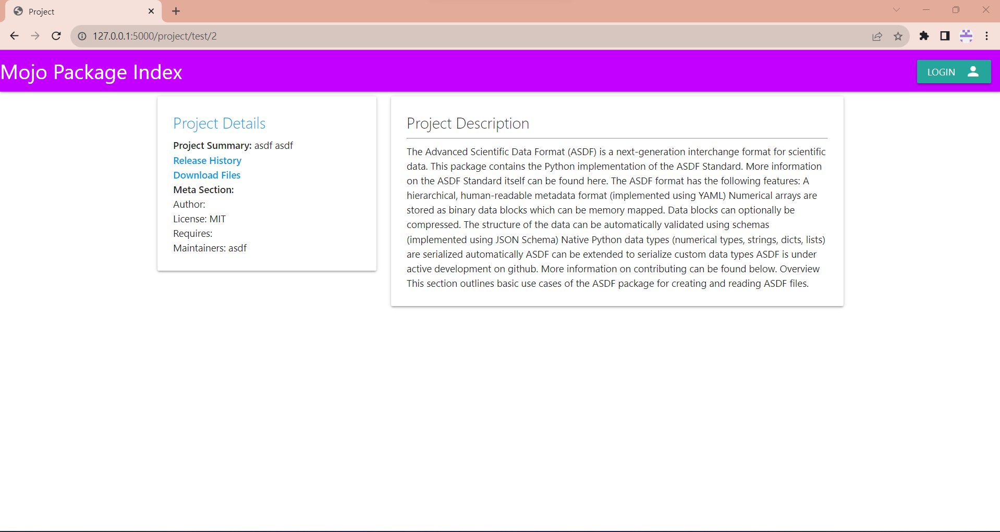
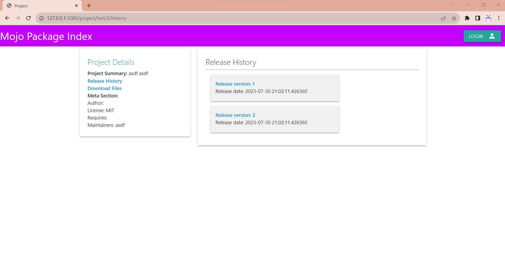
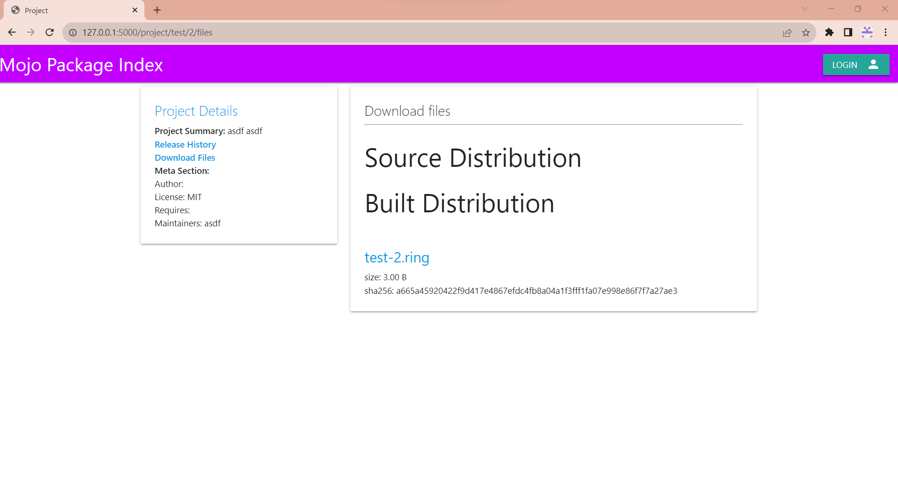
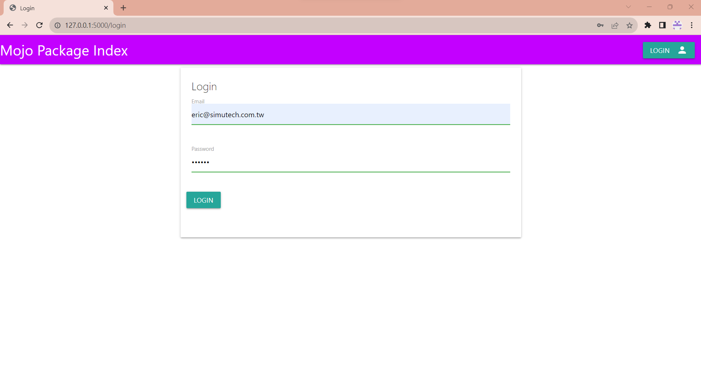
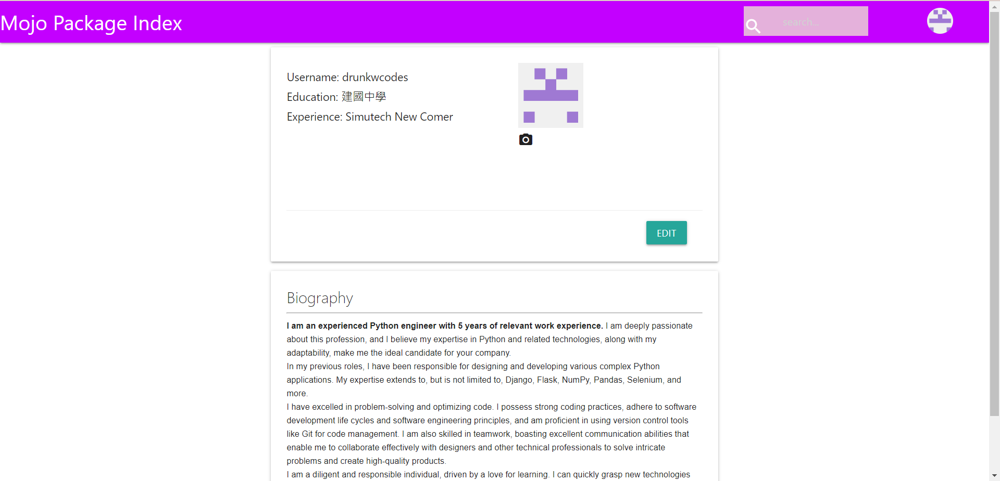
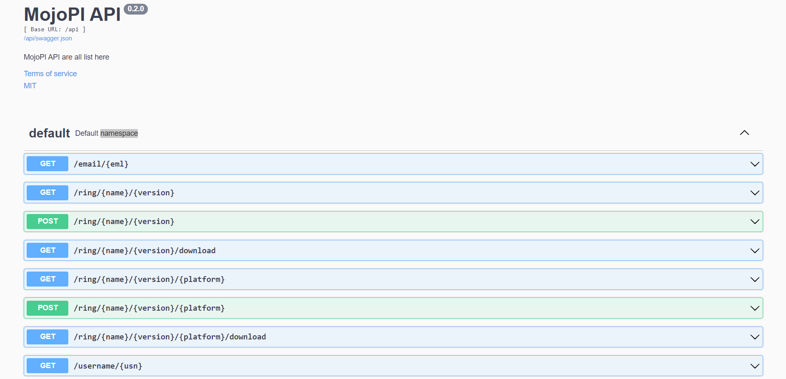
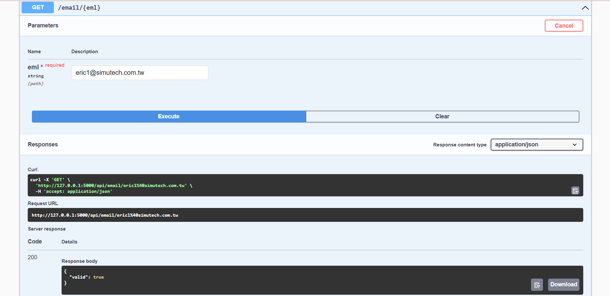

# Mojo Package Index

If something is not working for you, please check out [0.1.0](https://github.com/drunkwcodes/mojopi/tree/0.1.0) first for the smoothest experience.

`git checkout 0.1.0`

### Installation and Usage

The following steps will clone two projects and install them into the same `.venv`:

- Use `pip install pdm`

- `git clone git@github.com:drunkwcodes/mojopi.git`
- `git clone git@github.com:drunkwcodes/mups.git`
- `cd mojopi`
- `pdm install -d`
- `cd ../mups`
- `pdm use -f /path/to/mojopi/.venv`
- `pdm install`
- cd back to mojopi `cd ../mojopi`

- activate venv

    Windows:
    `.venv\Scripts\activate`

    Linux:
    `.venv/bin/activate`

- `python src/mojopi/admin.py` to start server with admin mode.
- Open web browser, open 127.0.0.1:5000

### Screenshots

1. Index Page

2. Search Result

3. Project Page

4. Project Releases

5. Project Downloads

6. Login Page

7. Profile

### API doc

open `http://127.0.0.1:5000/doc`, you will see:

### Contruibuting

Please see [CONTRIBUTING](CONTRIBUTING.md)

**Seeking experienced Materializecss frontend developers!**
There are quite a lot of UIs to be tweaked. The TODOs are in the [TODO.md](TODO.md)